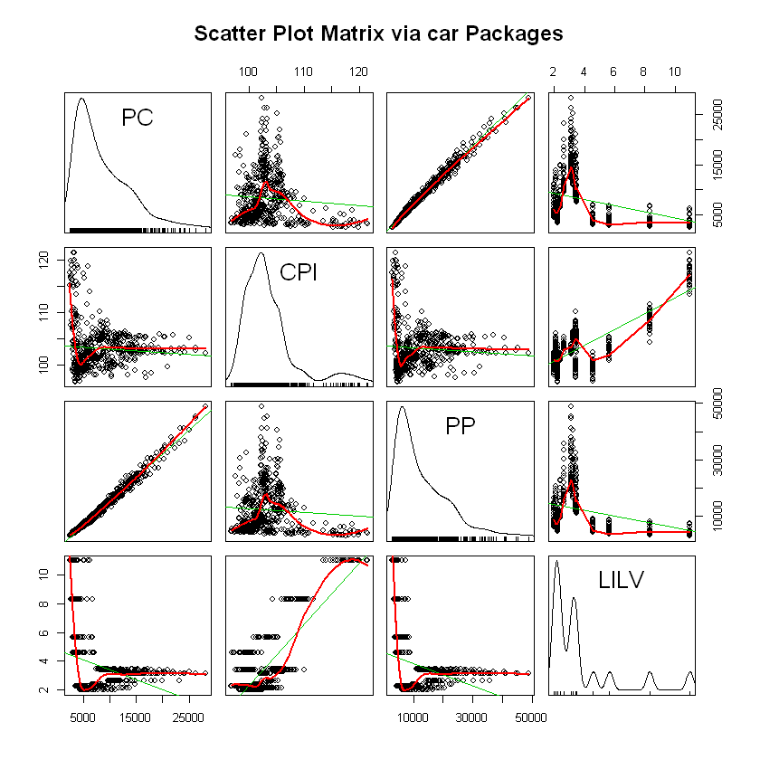

# R中实现面板数据

## 面板数据简介

面板数据：多个观测对象的时间序列数据所组成的样本数据，如下图所示

基本特征：数据结构的二维性

面板数据的优势： 1.扩大信息量，增加估计和检验统计量的自由度。 

                 2.有助于提供动态分析的可靠性。 
            
                 3.有助于反映经济结构、经济制度的渐进性变化。
                
                 4.面板数据模型有助于反映经济体的结构性特征。 
            


## R处理面板数据的步骤

### 数据整理

面板数据为长列表型数据，我们从数据库等下载的数据若为宽型数据，则需要先将其整理为长型数据。R中处理数据方法如下,可以使用tidyr包中的gather,也可以使用reshape包，下面示例使用tidyr包

当然，将数据整理成面板数据也不是必须要使用R，推荐使用STATA,其中的RESHAPE函数整理数据更为直观简单


```R
options(repos = c(CRAN = "https://mirrors.tuna.tsinghua.edu.cn/CRAN/"))
install.packages("tidyr")
library(tidyr)
sample_data=read.csv("sample_data.csv")
sample_data
sample_data$subject=factor(sample_data$subject)
data_long=gather(sample_data,condition,mesurement,control:cond3)
data_long
```

    Warning message:
    "package 'tidyr' is in use and will not be installed"


<table>
<thead><tr><th scope=col>subject</th><th scope=col>sex</th><th scope=col>control</th><th scope=col>cond1</th><th scope=col>cond2</th><th scope=col>cond3</th></tr></thead>
<tbody>
	<tr><td>1  </td><td>M  </td><td>1.1</td><td>1.2</td><td>1.3</td><td>1.4</td></tr>
	<tr><td>2  </td><td>F  </td><td>2.1</td><td>2.2</td><td>2.3</td><td>2.4</td></tr>
	<tr><td>3  </td><td>M  </td><td>3.1</td><td>3.2</td><td>3.3</td><td>3.4</td></tr>
	<tr><td>4  </td><td>M  </td><td>4.1</td><td>4.2</td><td>4.3</td><td>4.4</td></tr>
</tbody>
</table>


<table>
<thead><tr><th scope=col>subject</th><th scope=col>sex</th><th scope=col>condition</th><th scope=col>mesurement</th></tr></thead>
<tbody>
	<tr><td>1      </td><td>M      </td><td>control</td><td>1.1    </td></tr>
	<tr><td>2      </td><td>F      </td><td>control</td><td>2.1    </td></tr>
	<tr><td>3      </td><td>M      </td><td>control</td><td>3.1    </td></tr>
	<tr><td>4      </td><td>M      </td><td>control</td><td>4.1    </td></tr>
	<tr><td>1      </td><td>M      </td><td>cond1  </td><td>1.2    </td></tr>
	<tr><td>2      </td><td>F      </td><td>cond1  </td><td>2.2    </td></tr>
	<tr><td>3      </td><td>M      </td><td>cond1  </td><td>3.2    </td></tr>
	<tr><td>4      </td><td>M      </td><td>cond1  </td><td>4.2    </td></tr>
	<tr><td>1      </td><td>M      </td><td>cond2  </td><td>1.3    </td></tr>
	<tr><td>2      </td><td>F      </td><td>cond2  </td><td>2.3    </td></tr>
	<tr><td>3      </td><td>M      </td><td>cond2  </td><td>3.3    </td></tr>
	<tr><td>4      </td><td>M      </td><td>cond2  </td><td>4.3    </td></tr>
	<tr><td>1      </td><td>M      </td><td>cond3  </td><td>1.4    </td></tr>
	<tr><td>2      </td><td>F      </td><td>cond3  </td><td>2.4    </td></tr>
	<tr><td>3      </td><td>M      </td><td>cond3  </td><td>3.4    </td></tr>
	<tr><td>4      </td><td>M      </td><td>cond3  </td><td>4.4    </td></tr>
</tbody>
</table>


### 数据预处理

安装PLM包，用以处理面板数据

1.首先读入数据，然后为数据标明主个体名和时间名

2.对数据进行平稳性检验,使用purtest进行单位根检验
install.packages("plm")
install.packages("tseries")
library(tseries)
library(plm)
library(xts)

```R
dataset=read.csv('PANNEL_DATA.csv')
panel_dataset<-plm.data(dataset, index = c("NAME", "TIME"))
head(panel_dataset)
```


<table>
<thead><tr><th></th><th scope=col>NAME</th><th scope=col>TIME</th><th scope=col>CODE</th><th scope=col>PC</th><th scope=col>CPI</th><th scope=col>PP</th><th scope=col>LILV</th></tr></thead>
<tbody>
	<tr><th scope=row>210</th><td>安徽   </td><td>1995   </td><td>340000 </td><td>3161.41</td><td>114.8  </td><td>3796.93</td><td>10.980 </td></tr>
	<tr><th scope=row>211</th><td>安徽   </td><td>1996   </td><td>340000 </td><td>3607.43</td><td>109.9  </td><td>4515.48</td><td> 8.325 </td></tr>
	<tr><th scope=row>212</th><td>安徽   </td><td>1997   </td><td>340000 </td><td>3693.55</td><td>101.3  </td><td>4619.95</td><td> 5.670 </td></tr>
	<tr><th scope=row>213</th><td>安徽   </td><td>1998   </td><td>340000 </td><td>3777.41</td><td>100.0  </td><td>4798.76</td><td> 4.590 </td></tr>
	<tr><th scope=row>214</th><td>安徽   </td><td>1999   </td><td>340000 </td><td>3901.81</td><td> 97.8  </td><td>5101.77</td><td> 2.250 </td></tr>
	<tr><th scope=row>215</th><td>安徽   </td><td>2000   </td><td>340000 </td><td>4232.98</td><td>100.7  </td><td>5331.58</td><td> 2.250 </td></tr>
</tbody>
</table>


检测方法有5种，Levin andLin很早就发现这些估计量的极限分布是高斯分布,这些结果也被应用在有异方差的面板数据中,并建立了对面板单位根进行检验的早期版本。后来经过Levin的改进,提出了检验面板单位根的LLC法。Levin指出,该方法允许不同截距和时间趋势,异方差和高阶序列相关,适合于中等维度(时间序列介于25～250 之间,截面数介于10～250 之间) 的面板单位根检验。Im 还提出了检验面板单位根的IPS 法,但Breitung发现IPS 法对限定性趋势的设定极为敏感,并提出了面板单位根检验的Breitung法。Maddala and Wu又提出了ADF-Fisher和PP-Fisher面板单位根检验方法。

有时为了方便，只采用两种面板数据单位根检验方法，即相同根单位根检验LLC（Levin-Lin-Chu）检验和不同根单位根检验Fisher-ADF检验

    purtest(object, data = NULL, index = NULL,test= c("levinlin", "ips", "madwu", "hadri"),exo = c("none", "intercept", "trend"),lags = c("SIC", "AIC", "Hall"), pmax = 10, Hcons = TRUE,q = NULL, dfcor = FALSE, fixedT = TRUE, ...)


```R
unitroot_test=function (x){
y=data.frame(split(x,panel_dataset$NAME))
print(purtest(y, pmax = 4, exo = "intercept", test = "madwu"))
print(purtest(y, pmax = 4, exo = "trend", test = "madwu"))
print(purtest(y, pmax = 4, exo = "trend", test = "ips"))
print(purtest(y, pmax = 4, exo = "trend", test = "hadri"))
}
```


```R
apply(pannel_dataset[,4:7],MARGIN=2,FUN =unitroot_test)
```

    
    	Maddala-Wu Unit-Root Test (ex. var.: Individual Intercepts)
    
    data:  y
    chisq = 1409.5, df = 58, p-value < 2.2e-16
    alternative hypothesis: stationarity
    
    
    	Maddala-Wu Unit-Root Test (ex. var.: Individual Intercepts and Trend)
    
    data:  y
    chisq = 144.06, df = 58, p-value = 2.832e-09
    alternative hypothesis: stationarity
    
    
    	Im-Pesaran-Shin Unit-Root Test (ex. var.: Individual Intercepts and
    	Trend)
    
    data:  y
    z = 14.66, p-value < 2.2e-16
    alternative hypothesis: stationarity
    
    
    	Hadri Test (ex. var.: Individual Intercepts and Trend)
    
    data:  y
    z = 49.559, p-value < 2.2e-16
    alternative hypothesis: at least one series has a unit root
    
    
    	Maddala-Wu Unit-Root Test (ex. var.: Individual Intercepts)
    
    data:  y
    chisq = 532.17, df = 58, p-value < 2.2e-16
    alternative hypothesis: stationarity
    
    
    	Maddala-Wu Unit-Root Test (ex. var.: Individual Intercepts and Trend)
    
    data:  y
    chisq = 705.65, df = 58, p-value < 2.2e-16
    alternative hypothesis: stationarity
    
    
    	Im-Pesaran-Shin Unit-Root Test (ex. var.: Individual Intercepts and
    	Trend)
    
    data:  y
    z = -11.342, p-value < 2.2e-16
    alternative hypothesis: stationarity
    
    
    	Hadri Test (ex. var.: Individual Intercepts and Trend)
    
    data:  y
    z = 17.561, p-value < 2.2e-16
    alternative hypothesis: at least one series has a unit root
    
    
    	Maddala-Wu Unit-Root Test (ex. var.: Individual Intercepts)
    
    data:  y
    chisq = 1950.1, df = 58, p-value < 2.2e-16
    alternative hypothesis: stationarity
    
    
    	Maddala-Wu Unit-Root Test (ex. var.: Individual Intercepts and Trend)
    
    data:  y
    chisq = 159.14, df = 58, p-value = 2.311e-11
    alternative hypothesis: stationarity
    
    
    	Im-Pesaran-Shin Unit-Root Test (ex. var.: Individual Intercepts and
    	Trend)
    
    data:  y
    z = 16.51, p-value < 2.2e-16
    alternative hypothesis: stationarity
    
    
    	Hadri Test (ex. var.: Individual Intercepts and Trend)
    
    data:  y
    z = 50.349, p-value < 2.2e-16
    alternative hypothesis: at least one series has a unit root
    
    
    	Maddala-Wu Unit-Root Test (ex. var.: Individual Intercepts)
    
    data:  y
    chisq = 1588.3, df = 58, p-value < 2.2e-16
    alternative hypothesis: stationarity
    
    
    	Maddala-Wu Unit-Root Test (ex. var.: Individual Intercepts and Trend)
    
    data:  y
    chisq = 978.32, df = 58, p-value < 2.2e-16
    alternative hypothesis: stationarity
    
    
    	Im-Pesaran-Shin Unit-Root Test (ex. var.: Individual Intercepts and
    	Trend)
    
    data:  y
    z = -19.764, p-value < 2.2e-16
    alternative hypothesis: stationarity
    
    
    	Hadri Test (ex. var.: Individual Intercepts and Trend)
    
    data:  y
    z = 36.41, p-value < 2.2e-16
    alternative hypothesis: at least one series has a unit root
    
    


    $PC
    
    	Hadri Test (ex. var.: Individual Intercepts and Trend)
    
    data:  y
    z = 49.559, p-value < 2.2e-16
    alternative hypothesis: at least one series has a unit root
    
    
    $CPI
    
    	Hadri Test (ex. var.: Individual Intercepts and Trend)
    
    data:  y
    z = 17.561, p-value < 2.2e-16
    alternative hypothesis: at least one series has a unit root
    
    
    $PP
    
    	Hadri Test (ex. var.: Individual Intercepts and Trend)
    
    data:  y
    z = 50.349, p-value < 2.2e-16
    alternative hypothesis: at least one series has a unit root
    
    
    $LILV
    
    	Hadri Test (ex. var.: Individual Intercepts and Trend)
    
    data:  y
    z = 36.41, p-value < 2.2e-16
    alternative hypothesis: at least one series has a unit root
    
    


```R
library(car)
scatterplotMatrix(~PC+CPI+PP+LILV,data=panel_dataset,spread=FALSE,main="Scatter Plot Matrix via car Packages")
```





### 模型选取

面板数据模型主要分为两类，一类是静态面板数据模型，一类是动态面板数据模型

静态面板模型：$$Y_i,t=a_1+a_2*X_2it+L+a_k*X_k,i,t+\epsilon_i,t$$
          $$\epsilon_i,t=\mu_i+\lambda_t+u_i,t$$
          
动态面板模型：$$Y_i,t=a_1+a_2*X_2it+L+a_k*X_k,i,t+\gamma*Y_i,t-1+\epsilon_i,t$$
          $$\epsilon_i,t=\mu_i+\lambda_t+u_i,t$$

区别在于动态面板包含被解释变量的滞后项

#### 静态面板模型

先研究消费和收入两个变量的关系，基于凯恩斯消费函数：
$$PC_i,t=\alpha+\beta*PP_i,t+u_i,t$$
PC代表年人均消费，PP代表i表示第i个省，t表示年份，数据集中一共有31个省份，由于数据的缺失删去了重庆市和西藏省，所以变为29个省

由于固定效应模型允许不可观测效应与解释变量之间存在相关性，而随机效应模型则不可以，所以固定效应模型被广泛认为在其他条件相同下更有说服力。不过随机效应模型在特定情况下也需得到应有，比如当关键的解释变量不随时间变化的时候，我们就无法用固定效应模型去估计它的效应。实际上在更多的时候，我们会两种估计都进行，然后进行进一步的检验


```R
form=PC~PP
gr_pool=plm(PC~PP, data =panel_dataset,model = "pooling")
print("混合模型")
summary(gr_pool)
```

    [1] "混合模型"
    


    Pooling Model
    
    Call:
    plm(formula = PC ~ PP, data = panel_dataset, model = "pooling")
    
    Balanced Panel: n=29, T=19, N=551
    
    Residuals :
       Min. 1st Qu.  Median 3rd Qu.    Max. 
    -1990.0  -314.0   -62.1   261.0  2370.0 
    
    Coefficients :
                  Estimate Std. Error t-value  Pr(>|t|)    
    (Intercept) 1.2272e+03 4.3557e+01  28.174 < 2.2e-16 ***
    PP          5.8001e-01 2.9363e-03 197.535 < 2.2e-16 ***
    ---
    Signif. codes:  0 '***' 0.001 '**' 0.01 '*' 0.05 '.' 0.1 ' ' 1
    
    Total Sum of Squares:    1.2882e+10
    Residual Sum of Squares: 178730000
    R-Squared:      0.98613
    Adj. R-Squared: 0.9861
    F-statistic: 39020.1 on 1 and 549 DF, p-value: < 2.22e-16


先建立固定效应模型，使用F检验判断应当使用固定效应模型还是混合模型

接着建立随机效应模型，使用Hausman检验判断应当使用固定效应模型还是随机效应模型


```R
gr_fe=plm(form,data=panel_dataset,model="within")
summary(gr_fe)
pFtest(gr_fe, gr_pool)
print("拒绝原假设选择固定效应模型")
```


    Oneway (individual) effect Within Model
    
    Call:
    plm(formula = form, data = panel_dataset, model = "within")
    
    Balanced Panel: n=29, T=19, N=551
    
    Residuals :
       Min. 1st Qu.  Median 3rd Qu.    Max. 
    -1720.0  -223.0    11.1   219.0  2070.0 
    
    Coefficients :
        Estimate Std. Error t-value  Pr(>|t|)    
    PP 0.5727930  0.0025069  228.49 < 2.2e-16 ***
    ---
    Signif. codes:  0 '***' 0.001 '**' 0.01 '*' 0.05 '.' 0.1 ' ' 1
    
    Total Sum of Squares:    1.041e+10
    Residual Sum of Squares: 102860000
    R-Squared:      0.99012
    Adj. R-Squared: 0.98957
    F-statistic: 52205.6 on 1 and 521 DF, p-value: < 2.22e-16


    
    	F test for individual effects
    
    data:  form
    F = 13.725, df1 = 28, df2 = 521, p-value < 2.2e-16
    alternative hypothesis: significant effects
    


    [1] "拒绝原假设选择固定效应模型"
    


```R
gr_re=plm(PC~PP,data=panel_dataset,model = "random")
summary(gr_re)
phtest(gr_re,gr_fe)
print("拒绝原假设，选择固定效应模型")
```


    Oneway (individual) effect Random Effect Model 
       (Swamy-Arora's transformation)
    
    Call:
    plm(formula = PC ~ PP, data = panel_dataset, model = "random")
    
    Balanced Panel: n=29, T=19, N=551
    
    Effects:
                       var  std.dev share
    idiosyncratic 197424.9    444.3 0.633
    individual    114268.8    338.0 0.367
    theta:  0.7113  
    
    Residuals :
       Min. 1st Qu.  Median 3rd Qu.    Max. 
    -1690.0  -223.0   -11.1   195.0  2180.0 
    
    Coefficients :
                  Estimate Std. Error t-value  Pr(>|t|)    
    (Intercept) 1.3073e+03 7.2669e+01   17.99 < 2.2e-16 ***
    PP          5.7350e-01 2.4969e-03  229.69 < 2.2e-16 ***
    ---
    Signif. codes:  0 '***' 0.001 '**' 0.01 '*' 0.05 '.' 0.1 ' ' 1
    
    Total Sum of Squares:    1.0616e+10
    Residual Sum of Squares: 109330000
    R-Squared:      0.9897
    Adj. R-Squared: 0.98968
    F-statistic: 52757.1 on 1 and 549 DF, p-value: < 2.22e-16


    
    	Hausman Test
    
    data:  PC ~ PP
    chisq = 10.077, df = 1, p-value = 0.001501
    alternative hypothesis: one model is inconsistent
    


    [1] "拒绝原假设，选择固定效应模型"
    


```R
inter<-fixef(gr_fe,effect="individual",type = "level")
print("得到个体截距项")
summary(inter)


```

    [1] "得到个体截距项"
    


<table>
<thead><tr><th></th><th scope=col>Estimate</th><th scope=col>Std. Error</th><th scope=col>t-value</th><th scope=col>Pr(&gt;|t|)</th></tr></thead>
<tbody>
	<tr><th scope=row>安徽</th><td>2194.246    </td><td>129.2493    </td><td>16.97686    </td><td>1.959744e-51</td></tr>
	<tr><th scope=row>北京</th><td>3437.573    </td><td>196.0734    </td><td>17.53207    </td><td>4.678078e-54</td></tr>
	<tr><th scope=row>福建</th><td>2500.333    </td><td>155.1885    </td><td>16.11159    </td><td>2.149762e-47</td></tr>
	<tr><th scope=row>甘肃</th><td>2249.160    </td><td>119.9571    </td><td>18.74970    </td><td>7.158210e-60</td></tr>
	<tr><th scope=row>广东</th><td>4038.073    </td><td>173.5172    </td><td>23.27189    </td><td>7.468387e-82</td></tr>
	<tr><th scope=row>广西</th><td>2113.788    </td><td>133.6589    </td><td>15.81479    </td><td>5.051153e-46</td></tr>
	<tr><th scope=row>贵州</th><td>2087.061    </td><td>122.4547    </td><td>17.04354    </td><td>9.515419e-52</td></tr>
	<tr><th scope=row>海南</th><td>2158.557    </td><td>128.8205    </td><td>16.75632    </td><td>2.126376e-50</td></tr>
	<tr><th scope=row>河北</th><td>1798.823    </td><td>129.1942    </td><td>13.92340    </td><td>1.658149e-37</td></tr>
	<tr><th scope=row>河南</th><td>1853.037    </td><td>126.3289    </td><td>14.66836    </td><td>8.227812e-41</td></tr>
	<tr><th scope=row>黑龙江</th><td>2141.971    </td><td>121.7155    </td><td>17.59818    </td><td>2.272460e-54</td></tr>
	<tr><th scope=row>湖北</th><td>2360.090    </td><td>129.7768    </td><td>18.18576    </td><td>3.613625e-57</td></tr>
	<tr><th scope=row>湖南</th><td>2554.038    </td><td>132.3935    </td><td>19.29126    </td><td>1.760952e-62</td></tr>
	<tr><th scope=row>吉林</th><td>2438.240    </td><td>125.8044    </td><td>19.38120    </td><td>6.476697e-63</td></tr>
	<tr><th scope=row>江苏</th><td>2156.269    </td><td>156.0734    </td><td>13.81574    </td><td>4.910673e-37</td></tr>
	<tr><th scope=row>江西</th><td>1766.508    </td><td>125.2136    </td><td>14.10795    </td><td>2.556991e-38</td></tr>
	<tr><th scope=row>辽宁</th><td>2593.260    </td><td>134.7719    </td><td>19.24185    </td><td>3.049740e-62</td></tr>
	<tr><th scope=row>内蒙古</th><td>2724.301    </td><td>131.2062    </td><td>20.76351    </td><td>1.275099e-69</td></tr>
	<tr><th scope=row>宁夏</th><td>2224.443    </td><td>126.1019    </td><td>17.64004    </td><td>1.438056e-54</td></tr>
	<tr><th scope=row>青海</th><td>1916.582    </td><td>123.2441    </td><td>15.55111    </td><td>8.210585e-45</td></tr>
	<tr><th scope=row>山东</th><td>1965.148    </td><td>144.0225    </td><td>13.64473    </td><td>2.733607e-36</td></tr>
	<tr><th scope=row>山西</th><td>1616.185    </td><td>126.7523    </td><td>12.75074    </td><td>1.835088e-32</td></tr>
	<tr><th scope=row>陕西</th><td>2591.400    </td><td>126.6851    </td><td>20.45545    </td><td>4.017237e-68</td></tr>
	<tr><th scope=row>上海</th><td>3862.544    </td><td>208.4065    </td><td>18.53370    </td><td>7.797516e-59</td></tr>
	<tr><th scope=row>四川</th><td>2684.544    </td><td>128.5620    </td><td>20.88132    </td><td>3.404383e-70</td></tr>
	<tr><th scope=row>天津</th><td>2882.926    </td><td>162.1066    </td><td>17.78414    </td><td>2.971356e-55</td></tr>
	<tr><th scope=row>新疆</th><td>2229.168    </td><td>125.1684    </td><td>17.80935    </td><td>2.254396e-55</td></tr>
	<tr><th scope=row>云南</th><td>2194.132    </td><td>132.3461    </td><td>16.57874    </td><td>1.440965e-49</td></tr>
	<tr><th scope=row>浙江</th><td>2992.631    </td><td>183.3476    </td><td>16.32217    </td><td>2.263735e-48</td></tr>
</tbody>
</table>


将所有变量取对数,增加利率和物价这两个变量


```R
all_fe=plm(log(PC)~log(PP)+log(LILV)+log(CPI),data=panel_dataset,model = 'within')
summary(all_fe)
all_re=plm(log(PC)~log(PP)+log(LILV)+log(CPI),data=panel_dataset,model = 'random')
summary(all_re)
phtest(all_re,all_fe)
```


    Oneway (individual) effect Within Model
    
    Call:
    plm(formula = log(PC) ~ log(PP) + log(LILV) + log(CPI), data = panel_dataset, 
        model = "within")
    
    Balanced Panel: n=29, T=19, N=551
    
    Residuals :
         Min.   1st Qu.    Median   3rd Qu.      Max. 
    -0.164000 -0.020600 -0.000522  0.021200  0.136000 
    
    Coefficients :
                Estimate Std. Error  t-value  Pr(>|t|)    
    log(PP)    0.8453025  0.0028517 296.4232 < 2.2e-16 ***
    log(LILV)  0.0144596  0.0052369   2.7611  0.005965 ** 
    log(CPI)  -0.1154048  0.0582464  -1.9813  0.048082 *  
    ---
    Signif. codes:  0 '***' 0.001 '**' 0.01 '*' 0.05 '.' 0.1 ' ' 1
    
    Total Sum of Squares:    137.94
    Residual Sum of Squares: 0.68893
    R-Squared:      0.99501
    Adj. R-Squared: 0.99471
    F-statistic: 34466.4 on 3 and 519 DF, p-value: < 2.22e-16


    Oneway (individual) effect Random Effect Model 
       (Swamy-Arora's transformation)
    
    Call:
    plm(formula = log(PC) ~ log(PP) + log(LILV) + log(CPI), data = panel_dataset, 
        model = "random")
    
    Balanced Panel: n=29, T=19, N=551
    
    Effects:
                       var  std.dev share
    idiosyncratic 0.001327 0.036434 0.533
    individual    0.001165 0.034134 0.467
    theta:  0.7622  
    
    Residuals :
         Min.   1st Qu.    Median   3rd Qu.      Max. 
    -1.60e-01 -2.15e-02  1.39e-05  2.25e-02  1.38e-01 
    
    Coefficients :
                  Estimate Std. Error  t-value  Pr(>|t|)    
    (Intercept)  1.6199715  0.2638149   6.1406 1.582e-09 ***
    log(PP)      0.8462023  0.0028584 296.0361 < 2.2e-16 ***
    log(LILV)    0.0151042  0.0052718   2.8651  0.004329 ** 
    log(CPI)    -0.1193920  0.0586565  -2.0354  0.042288 *  
    ---
    Signif. codes:  0 '***' 0.001 '**' 0.01 '*' 0.05 '.' 0.1 ' ' 1
    
    Total Sum of Squares:    139.51
    Residual Sum of Squares: 0.73786
    R-Squared:      0.99471
    Adj. R-Squared: 0.99468
    F-statistic: 34292.5 on 3 and 547 DF, p-value: < 2.22e-16


    
    	Hausman Test
    
    data:  log(PC) ~ log(PP) + log(LILV) + log(CPI)
    chisq = 21.648, df = 3, p-value = 7.72e-05
    alternative hypothesis: one model is inconsistent
    


由上述结果可以看出，应该选取固定效应模型,收入与消费两者成正相关关系，消费的收入弹性系数为0.8453。物价和消费成负相关性。利率的影响较小。

商品的物价水平对于消费者的消费存在着影响,一方面,物价水平是发展的一个标志。的上升意味着家庭工资、收入的增加, 消费者进行大量的消费, 使得供求双方之间的矛盾进一步加剧, 物价有上升的趋势。同时, 物价上升使得居民购买力下降, 物价又对消费产生负面的影响。物价对于消费是正面还是负面影响取决于这两种此消彼长的力量的大小。

名义利率对消费的影响为正值，在名义利率对于城市居民消费的两种效应当中, 收入效应大于替代效应。这与实际利率的替代效应占优势的结论是相反的, 但这并不矛盾,这是因为我国实际利率与名义利率的走势是相反的。自 1996 年以来 , 中央银行连续下调名义利率, 2002 年末的一年期存款利率已经降到1.98%, 是 50 年来历史最低点。但是 , 由于自 1998 年以来我国进入明显的通货紧缩阶段, 这就使得我国的实际利率仍然居高不下。名义利率对于城市居民消费的收入效应大于替代效应,使得城市居民消费与名义利率呈同方向变动趋势, 这样 , 当我国中央银行下调名义利率时, 城市居民的实际消费支出也会下降。

#### 动态面板模型

在动态面板模型中，因变量的滞后项作为解释变量，而滞后项和随机扰动往往存在相关，这就会导致内生性问题。

为解决这个问题，Arellano和Bond提出了广义矩(GMM)估计的方法。首先提出了差分GMM估计方法：$$\Delta y_i,t=\rho*\Delta y_i,t-1+\theta*\Delta x_i,t+\Delta u_i,t$$
差分后，模型中的差分序列不再随时间变化,即不再与随机扰动相关,各个差分项的
时间序列是平稳的

虽然差分GMM估计之方法可以解决工具变量的问题,也能得到一致估计的结果，但在有限样本情况下，容易受到弱工具变量的影响。为了克服这个问题，又提出了系统GMM估计方法，是将没差分的模型和差分的模型看作一个系统，用差分方程中的变量作为未差分方程的工具变量


动态面板模型设定为：$$lnPC=\theta+\lambda*PC_t-1+\alpha*lnPP+\beta*lnCPI+\phi*lnLILV$$
下面将分别用差分GMM(一步,两步)和系统GMM(一步，两布)对样本数据进行分析

在实际估计中，若加入利率作为变量，则无法估计出结果，所以下面分析将去掉利率这个变量


```R
chafen_gmm_one=pgmm(log(PC)~log(PP)+log(CPI)+lag(log(PC))| lag(log(PC),2:19),data =panel_dataset, effect = "twoways", model = "onestep")
print("差分GMM一步估计")
summary(chafen_gmm_one)
```

    Warning message in pgmm(log(PC) ~ log(PP) + log(CPI) + lag(log(PC)) | lag(log(PC), :
    "the second-step matrix is singular, a general inverse is used"

    [1] "差分GMM一步估计"
    

    Warning message in vcovHC.pgmm(object):
    "a general inverse is used"


    Twoways effects One step model
    
    Call:
    pgmm(formula = log(PC) ~ log(PP) + log(CPI) + lag(log(PC)) | 
        lag(log(PC), 2:19), data = panel_dataset, effect = "twoways", 
        model = "onestep")
    
    Balanced Panel: n=29, T=19, N=551
    
    Number of Observations Used:  493 
    
    Residuals
          Min.    1st Qu.     Median       Mean    3rd Qu.       Max. 
    -0.0934100 -0.0171500  0.0005285  0.0000000  0.0172000  0.1054000 
    
    Coefficients
                 Estimate Std. Error z-value Pr(>|z|)    
    log(PP)      0.630871   0.059098 10.6751  < 2e-16 ***
    log(CPI)     0.411106   0.150114  2.7386  0.00617 ** 
    lag(log(PC)) 0.479001   0.103511  4.6276  3.7e-06 ***
    ---
    Signif. codes:  0 '***' 0.001 '**' 0.01 '*' 0.05 '.' 0.1 ' ' 1
    
    Sargan Test: chisq(152) = 29 (p.value=1)
    Autocorrelation test (1): normal = -3.684102 (p.value=0.00022951)
    Autocorrelation test (2): normal = 1.348018 (p.value=0.17765)
    Wald test for coefficients: chisq(3) = 208.3813 (p.value=< 2.22e-16)
    Wald test for time dummies: chisq(17) = 146.8162 (p.value=< 2.22e-16)


```R
chafen_gmm_two=pgmm(log(PC)~log(PP)+log(CPI)+lag(log(PC))| lag(log(PC),2:99
 ),data =panel_dataset, effect = "twoways", model = "onestep")
print("差分GMM两步估计")
summary(chafen_gmm_one,robust = TRUE)

```

    Warning message in pgmm(log(PC) ~ log(PP) + log(CPI) + lag(log(PC)) | lag(log(PC), :
    "the second-step matrix is singular, a general inverse is used"

    [1] "差分GMM两步估计"
    

    Warning message in vcovHC.pgmm(object):
    "a general inverse is used"


    Twoways effects One step model
    
    Call:
    pgmm(formula = log(PC) ~ log(PP) + log(CPI) + lag(log(PC)) | 
        lag(log(PC), 2:99), data = panel_dataset, effect = "twoways", 
        model = "onestep")
    
    Balanced Panel: n=29, T=19, N=551
    
    Number of Observations Used:  493 
    
    Residuals
          Min.    1st Qu.     Median       Mean    3rd Qu.       Max. 
    -0.0934100 -0.0171500  0.0005285  0.0000000  0.0172000  0.1054000 
    
    Coefficients
                 Estimate Std. Error z-value Pr(>|z|)    
    log(PP)      0.630871   0.059098 10.6751  < 2e-16 ***
    log(CPI)     0.411106   0.150114  2.7386  0.00617 ** 
    lag(log(PC)) 0.479001   0.103511  4.6276  3.7e-06 ***
    ---
    Signif. codes:  0 '***' 0.001 '**' 0.01 '*' 0.05 '.' 0.1 ' ' 1
    
    Sargan Test: chisq(152) = 29 (p.value=1)
    Autocorrelation test (1): normal = -3.684102 (p.value=0.00022951)
    Autocorrelation test (2): normal = 1.348018 (p.value=0.17765)
    Wald test for coefficients: chisq(3) = 208.3813 (p.value=< 2.22e-16)
    Wald test for time dummies: chisq(17) = 146.8162 (p.value=< 2.22e-16)


```R
xitong_gmm_one=pgmm(log(PC)~log(PP)+log(CPI)+lag(log(PC))| lag(log(PC),2:99)
,data =panel_dataset, effect = "twoways", model = "twosteps",transformation = "ld")
print("系统GMM一步估计")
summary(xitong_gmm_one,robust = TRUE)
```

    Warning message in pgmm(log(PC) ~ log(PP) + log(CPI) + lag(log(PC)) | lag(log(PC), :
    "the second-step matrix is singular, a general inverse is used"

    [1] "系统GMM一步估计"
    

    Warning message in vcovHC.pgmm(object):
    "a general inverse is used"


    Twoways effects Two steps model
    
    Call:
    pgmm(formula = log(PC) ~ log(PP) + log(CPI) + lag(log(PC)) | 
        lag(log(PC), 2:99), data = panel_dataset, effect = "twoways", 
        model = "twosteps", transformation = "ld")
    
    Balanced Panel: n=29, T=19, N=551
    
    Number of Observations Used:  1015 
    
    Residuals
          Min.    1st Qu.     Median       Mean    3rd Qu.       Max. 
    -1.298e-01 -2.161e-02  8.136e-04  5.219e-05  2.216e-02  1.233e-01 
    
    Coefficients
                  Estimate Std. Error z-value Pr(>|z|)    
    log(PP)       0.849463   0.150191  5.6559 1.55e-08 ***
    log(CPI)     -0.027273   0.637444 -0.0428   0.9659    
    lag(log(PC))  0.082567   0.161525  0.5112   0.6092    
    ---
    Signif. codes:  0 '***' 0.001 '**' 0.01 '*' 0.05 '.' 0.1 ' ' 1
    
    Sargan Test: chisq(171) = 1.478862 (p.value=1)
    Autocorrelation test (1): normal = -1.514641 (p.value=0.12986)
    Autocorrelation test (2): normal = 0.4499548 (p.value=0.65274)
    Wald test for coefficients: chisq(3) = 37864.87 (p.value=< 2.22e-16)
    Wald test for time dummies: chisq(17) = 197.3708 (p.value=< 2.22e-16)


```R
xitong_gmm_two=pgmm(log(PC)~log(PP)+log(CPI)+lag(log(PC))| lag(log(PC),2:99
),data =panel_dataset, effect = "twoways", model = "onestep",transformation = "ld")
print("系统GMM两步估计")
summary(xitong_gmm_two,robust = TRUE)
```

    Warning message in pgmm(log(PC) ~ log(PP) + log(CPI) + lag(log(PC)) | lag(log(PC), :
    "the second-step matrix is singular, a general inverse is used"

    [1] "系统GMM两步估计"
    

    Warning message in vcovHC.pgmm(object):
    "a general inverse is used"


    Twoways effects One step model
    
    Call:
    pgmm(formula = log(PC) ~ log(PP) + log(CPI) + lag(log(PC)) | 
        lag(log(PC), 2:99), data = panel_dataset, effect = "twoways", 
        model = "onestep", transformation = "ld")
    
    Balanced Panel: n=29, T=19, N=551
    
    Number of Observations Used:  1015 
    
    Residuals
        Min.  1st Qu.   Median     Mean  3rd Qu.     Max. 
    -0.13830 -0.01921  0.00096  0.00000  0.01962  0.13930 
    
    Coefficients
                 Estimate Std. Error z-value  Pr(>|z|)    
    log(PP)      0.234063   0.067442  3.4706 0.0005194 ***
    log(CPI)     0.541292   0.183228  2.9542 0.0031349 ** 
    lag(log(PC)) 0.746625   0.071732 10.4085 < 2.2e-16 ***
    ---
    Signif. codes:  0 '***' 0.001 '**' 0.01 '*' 0.05 '.' 0.1 ' ' 1
    
    Sargan Test: chisq(171) = 29 (p.value=1)
    Autocorrelation test (1): normal = -3.92115 (p.value=8.8127e-05)
    Autocorrelation test (2): normal = 0.6344594 (p.value=0.52578)
    Wald test for coefficients: chisq(3) = 34287.99 (p.value=< 2.22e-16)
    Wald test for time dummies: chisq(17) = 159.5639 (p.value=< 2.22e-16)


上述GMM估计结果均不稳健，因此在这几个控制变量下，动态面板模型并不能进行有效估计

## 总结
使用R处理面板数据，首先将数据整理成面板数据的形式，然后对变量进行稳健性检验，之后建立静态面板模型，根据F检验和豪斯曼检验确定应该使用的模型

进一步可以建立动态面板模型，分为4个GMM模型，分别建立这4个模型，检验其稳健性，以确定使用的动态面板模型
